<!--
    * Profile Template by: @dkitagawa | Douglas Kitagawa
    * Exclusivo for: https://github.com/sdkitagawa/sdkitagawa
    * All rights reserve
    * sdkitagawa, 2020-2026
-->

🧩 A **Software Engineer** who has been programming since the age of **11**, driven by curiosity and a genuine passion for technology.

> **Computer Lover** 💻 | **Music Production & Audio Engineering Lover** 🎧 | **Passionate about Neuroscience & Psychology** 🧠 | **Dedicated Educator** 🎓 | **Video Game Player** 🎮

I have a deep passion for sharing knowledge and promoting learning. My journey is marked by multidisciplinarity, with skills developed across several fields!

* 💫 Always aiming at **usability** and **code performance** at all costs.
* ✔️ Always learning backend technologies.
* :octocat: Also surfing on artificial intelligence stuff.

## Tech Stack - Main Languages  

    <picture>
        
        
        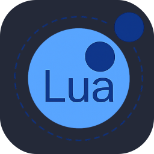
        
        
        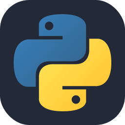
    </picture>

## Other Known Languages  

    <picture>
        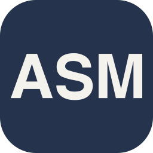
        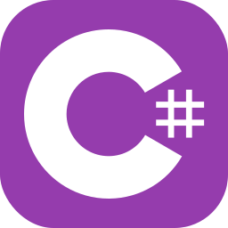
        
        
        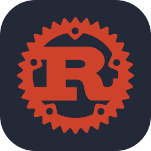
        
        
        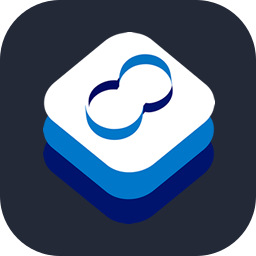
        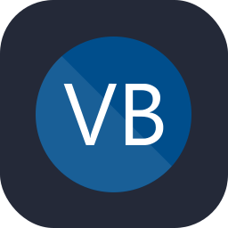
        
        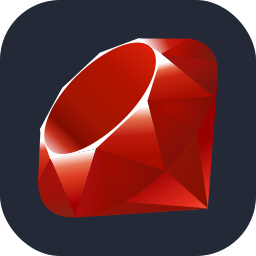
    </picture>

## Web, Data Bases, Libraries, Runtimes and Technologies  

    <picture>
        
        
        
        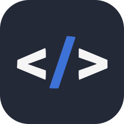
        
        
        
        
        
        
        
        
        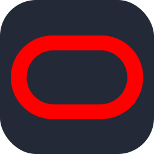
        
        
        
        
        
        
        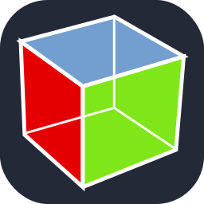
        
        
        
        
        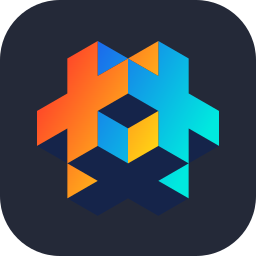
        
        
        
        
        
        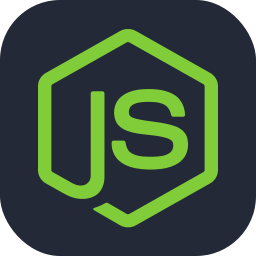
        
        
        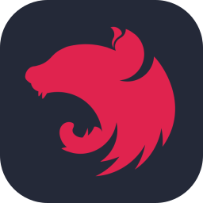
        
        
        
        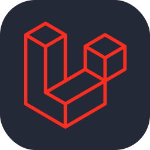
        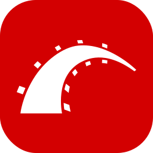
        
        
        
        
        
        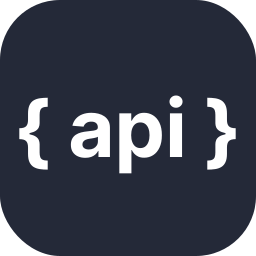
        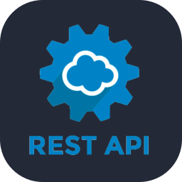
        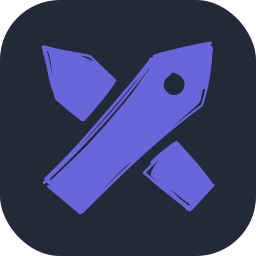
        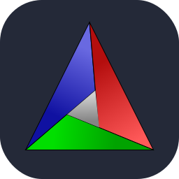
        
        
        
    </picture>

## PDEs, IDEs, Frameworks and DevOps Tools  

    <picture>
        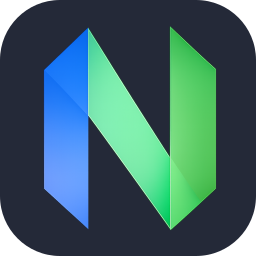
        
        
        
        
        
        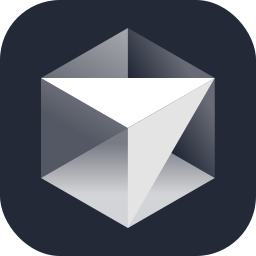
        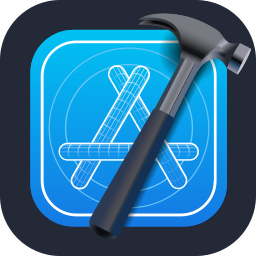
        
        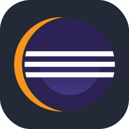
        
        
        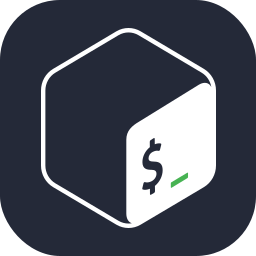
        
        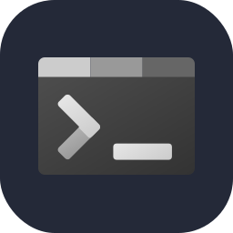
        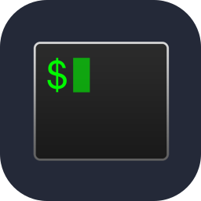
        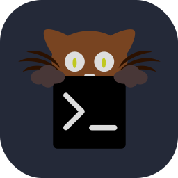
        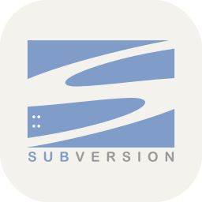
        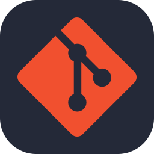
        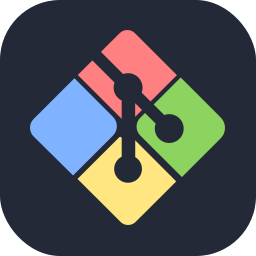
        
        
        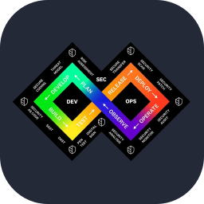
        
        
        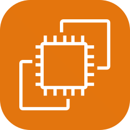
        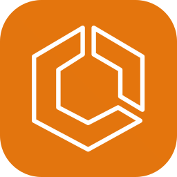
        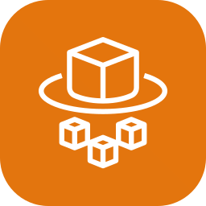
        
        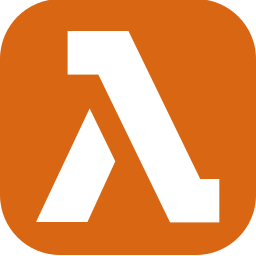
        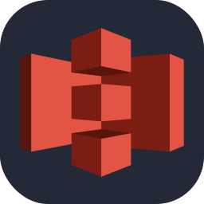
        
        
        
        
        
        
        
        
        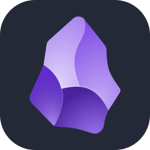
        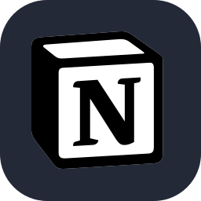
        
        
        
        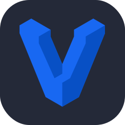
        
        
    </picture>

## Game Development Tools and Engines  

    <picture>
        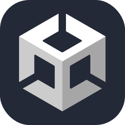
        
        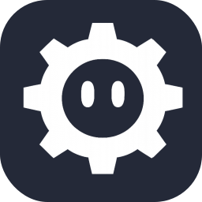
        
        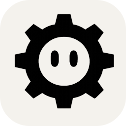
        
        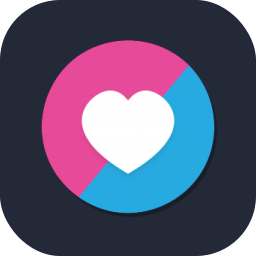
        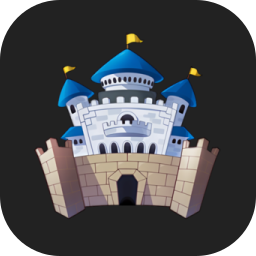
        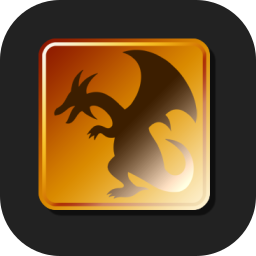
    </picture>

## Operational Systems  

    <picture>
        
        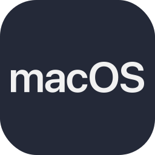
        
        
        
        
        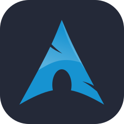
        
        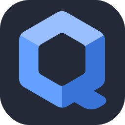
        
        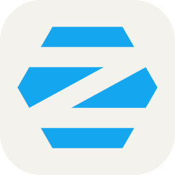
    </picture>

## AI and Agent Harness Tools  

    <picture>
        
        
        
        
        
        
        
        
        
        
        
        
        
        
        
    </picture>

## Multimedia Tools  

    <picture>
        
        
        
        
        
        
        
        
        
        
        
        
        
        
        
        
        
        
    </picture>

## Gaming Platforms  

    <picture>
        
        
        
        
    </picture>

## Github Achievements

    <picture>
        
        
        
        
        
        
        
        
        
    </picture>

 

> [!NOTE]
> `CTRL` or `⌘` + `Click` this to open any links in a new tab.
> 
> Open Sourcerer and Heart on Your Sleeve achievements were part of an [*experimental rollout and got disabled broadly by Github*](https://github.com/orgs/community/discussions/190842#discussioncomment-16350078).  
>   
> [**Click here**](https://raw.githubusercontent.com/sdkitagawa/sdkitagawa/refs/heads/main/assets/badges/evidence/dks_screenshot_saturday_march_28_2026_0h46m52s.png) for evidence.

## Stats  

##  Support my work  

    

<!--
  * Profile Template by: @dkitagawa | Douglas Kitagawa
-->
